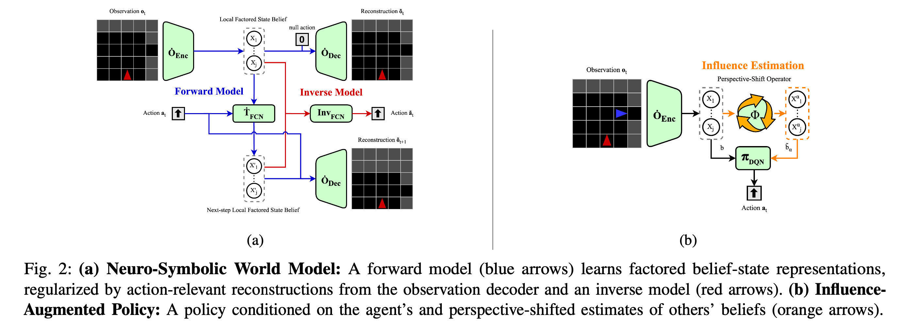
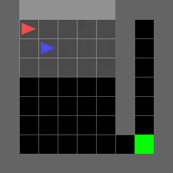
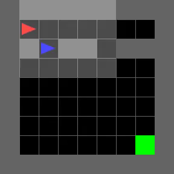
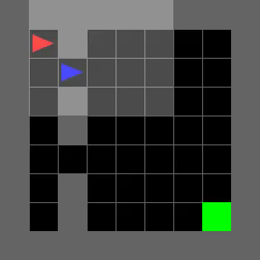
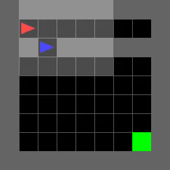
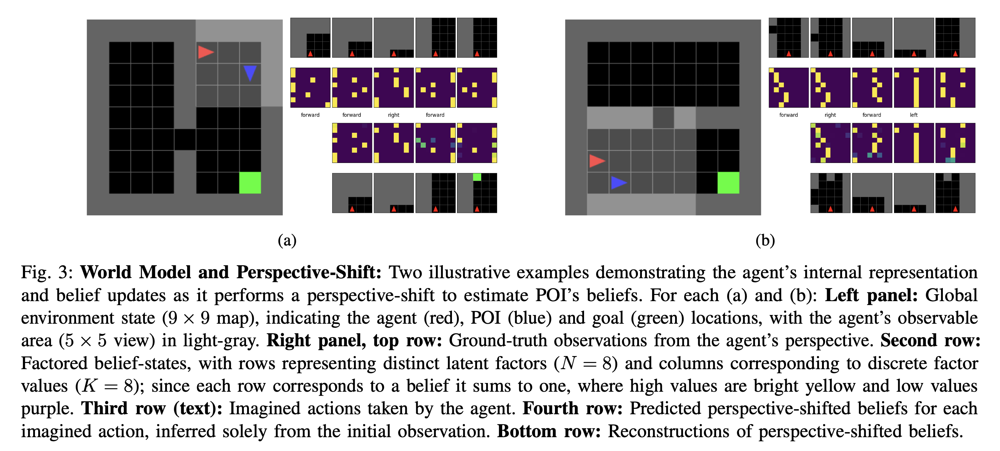

# Perspective-Shifted Neuro-Symbolic World Models: A Framework for Socially-Aware Robot Navigation

<p align="center">
  
</p>

**Abstract:** Navigating in environments alongside humans requires agents to reason under uncertainty and account for the beliefs and intentions of those around them. Under a sequential decision-making framework, egocentric navigation can naturally be represented as a Markov Decision Process (MDP). However, social navigation additionally requires reasoning about the hidden beliefs of others, inherently leading to a Partially Observable Markov Decision Process (POMDP), where agents lack direct access to others’ mental states. Inspired by Theory of Mind and Epistemic Planning, we propose (1) a neuro- symbolic model-based reinforcement learning architecture for social navigation, addressing the challenge of belief tracking in partially observable environments; and (2) a perspective- shift operator for belief estimation, leveraging recent work on Influence-based Abstractions (IBA) in structured multi-agent settings.

This repository contains the code for the models and experiments used in the paper. 

**Paper Status**: Pre-print (03/25/2025)

<p align="center">
  
  
  
  
</p>

<p align="center">
  
</p>


## Contents:
- Person-Following Environment implemented using [Minigrid](https://minigrid.farama.org/): 
  - `code/environments/person_following.py`
- Neuro-Symbolic World Model implemented as a discrete-VAE using the Gumbel-Softmax method: 
  - `code/models/world_model.py`
- Perspective-Shift Operator implemented with three estimation modes (perfect-information, mental-simulation and random): 
  - `code/models/influece_estimator.py`
- Influence-Augmented Policy implemented as a double-DQN: 
  - `code/models/belief_dqn.py`

## Model training:
- Neuro-Symbolic World Model Learning: 
  - `code/scripts/world_model_learning.py`
- Influence-Augmented Reinforcement Learning
  - For single model training: `code/scripts/policy_learning_experiments.py` 
  - For multiple jobs (and to compare estimation types as in the paper) see: `code/scripts/README.md`
- Visualize results: 
  - `code/visualize_results.ipynb`

## Citation
If you find this work useful, please reference it using:

```bibtex
@misc{alcedo2025_PSWM,
  author = {Alcedo, Kevin and Lima, Pedro U. and Alami, Rachid},
  title = {Perspective-Shifted Neuro-Symbolic World Models: A Framework for Socially-Aware Robot Navigation},
  year = {2025}
  }
```